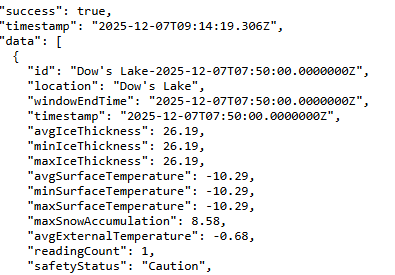
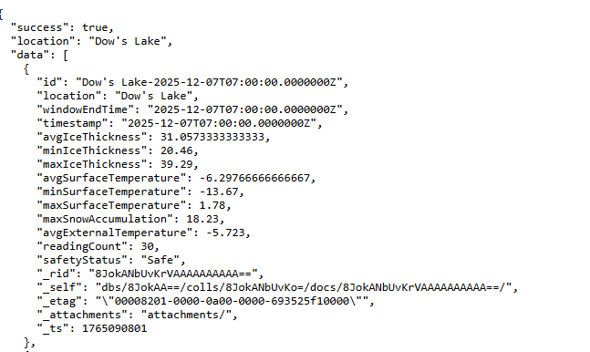
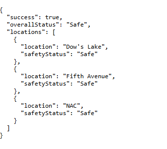
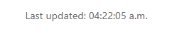
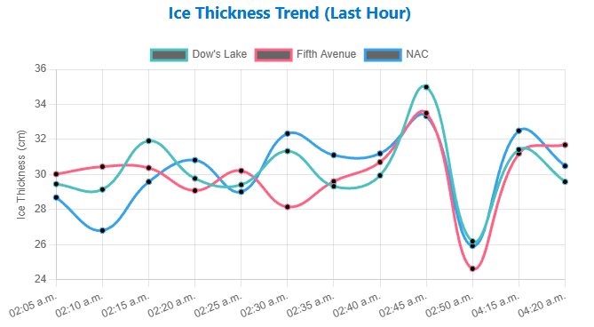
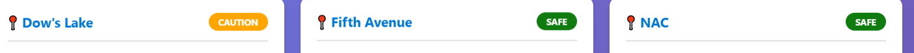

## 1. Overview
This repository contains the web dashboard for the Rideau Canal monitoring system. The dashboard displays real-time and historical ice condition data processed by Azure Stream Analytics and stored in Azure Cosmos DB.

Features:
- Live display of ice conditions for multiple canal locations
- Safety status indicators (Safe, Caution, Unsafe)
- Auto-refreshing data every 30 seconds
- Line charts showing trends over time

Technologies Used
- Node.js
- Azure Cosmos DB SDK
- HTML, CSS, JavaScript
- Chart.js for data visualization

## 2. Prerequisites
- Node.js
- Azure cosmosdb
- Azure App Service 
- GitHub account 

## 3. Installation
- Clone repo given to us
- install dependencies npm install
- node server.js
- open in browser

## 4. Configuration
create .env file with connection strings to test locally, add env variables to app services to run it there.

## 5. API Endpoints

/api/latest
returns the most recent aggreagated reading for each location

/api/history/:location
returns data for a specific location

/api/status
returns safety status based on all locations

## 6. Deployment to Azure App Service
- Create an Azure App Service
- Connect the App Service to this GitHub repository
- Configure environment variables in App Service:
    COSMOS_ENDPOINT
    COSMOS_KEY
    COSMOS_DATABASE
    COSMOS_CONTAINER
- Save settings
- GitHub Actions automatically builds and deploys the app.

Runtime stack: Node.js 20 LTS
Startup command: node server.js

## 7. Dashboard Features

Real-time updates
data references automatically as new analytics windows are produced

Charts and visualizations

Safety status indicators

## 8. Troubleshooting

No issues, dashboard was given to us.